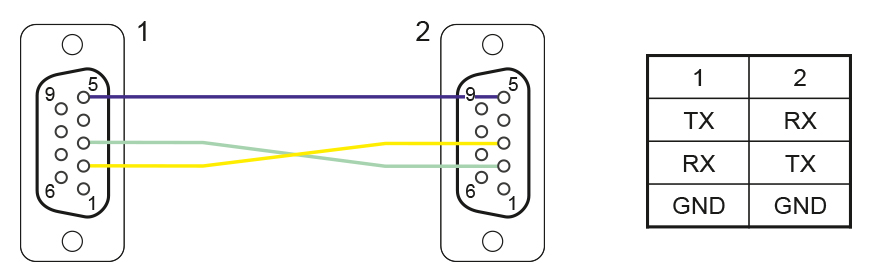
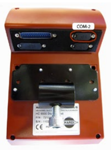

# AOG-TUVR Bridge

Bridge between **AgOpenGPS** and the **Trimble TUVR / HC5500** controller.

AgOpenGPS sends section states via UDP. This bridge translates them into
HC5500 serial commands (`S0C/6C`) so the controller opens and closes sections
in real time.

## Requirements

- Python 3.8+
- [pyserial](https://pypi.org/project/pyserial/) (`pip install pyserial`)
- RS-232 connection to the HC5500 (USB-to-RS232 adapter + null modem cable)
- [RS-232 adapter](https://www.aliexpress.com/item/1005009141854353.html)
- AgOpenGPS / AgIO broadcasting on UDP port 8888

## Connection


Make your own cable as pin4 has 12V on Hardi and your USB-RS232 adapter might not like it!




## Usage

Just download the exe from the Releases

On first run you will be prompted to select a COM port. The choice is saved
to `config.ini` so subsequent runs connect automatically.

## How It Works

```
AgOpenGPS (AgIO)  UDP:8888        Keyboard (X=exit)
       |                                |
       v                                v
 [UDP listener]                  [keyboard thread]
       |                                |
       +------> shared state <----------+
               sections[13]
               agio_connected
                    |
                    v
          [HC5500 serial threads]
          TX: boot/run cycle every 0.2s
          RX: parse HC5500 responses
                    |
                    v
             HC5500 via RS-232
```

### AgOpenGPS PGNs handled

| PGN byte | Name | Direction | What the bridge does |
|----------|------|-----------|----------------------|
| `0xC8` | AgIO Hello | IN | Replies with Hello Machine PGN so the machine icon turns green |
| `0xEF` | Machine Data | IN | Byte 11 = 8-bit section mask, forwarded to HC5500 |
| `0xFE` | Steer Data | IN | Speed logged (not sent to HC5500) |
| `0x7B` | Hello Reply | OUT | Sent to AgIO on port 9999 in response to Hello |
| `0xED` | From Machine | OUT | Sent to AgIO on port 9999 with current relay state |

### HC5500 serial commands (run mode, every 0.2 s)

| Command | Purpose |
|---------|---------|
| `S0C / 6C,{sections}` | Set 13-element section state |
| `R0D / 6B` | Read back section status |
| `R0D / 6D` | Read back mode/status |

Boot mode sends `R0D / 6A` every 1 s until the HC5500 responds.

## config.ini

Created automatically on first run.

```ini
[main]
com = COM3
comms_lost_zero = 1
```

| Key | Description |
|-----|-------------|
| `com` | Saved COM port (`0` = prompt on startup) |
| `comms_lost_zero` | `1` = close all sections when AgIO stops responding (3 s timeout). `0` = keep last state. |

## Keyboard

| Key | Action |
|-----|--------|
| X | Exit |

## Serial Settings

- Baud: 9600
- Data bits: 8, Parity: None, Stop bits: 1
- Timeout: 20 ms
